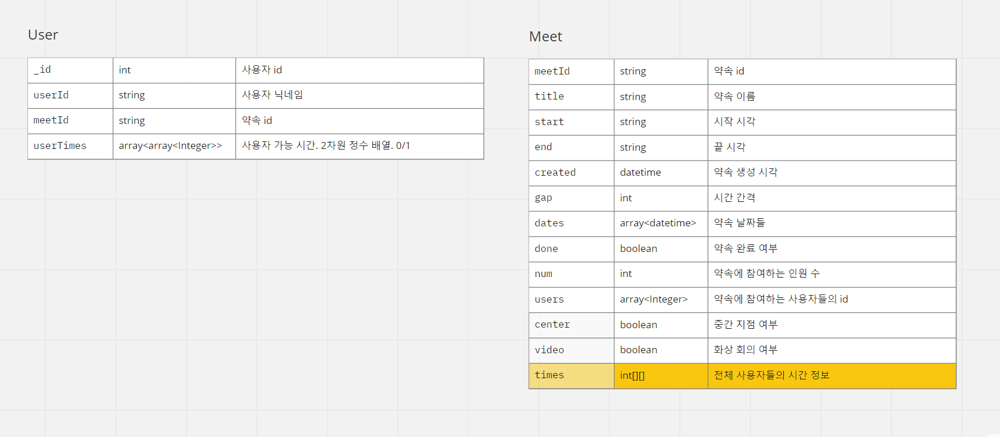
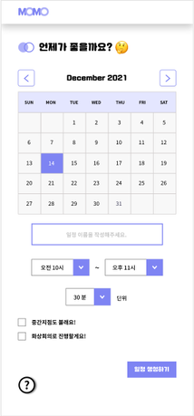
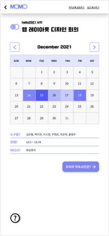
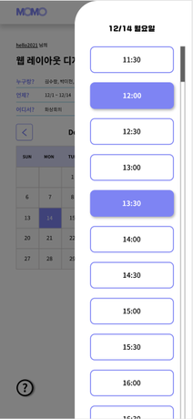
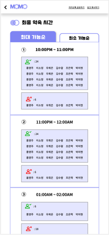

## 프로젝트 소개
- 여러 사람들이 약속을 잡는데 도움을 주는 사이트로 사용자들이 자신이 가능한 시간을 테이블에 선택하면 모두 가능한 시간을 계산하여 약속시간으로 추천해주는 사이트입니다.

## 데모버전
-[모모 데모버전](https://letsmeeet.azurewebsites.net/)

## 기술 스택
   - Springboot 2.4.1
   - spring-boot-starter-data-mongodb
   - spring-boot-starter-validation
   - spring-boot-starter-aop
   - lombok( + Slf4j) 1.18.12
   - spring-session-core 2.3.3
   - springfox-swagger2
   - junit5

   
## DB구조
#### MongoDB Collection

## 프로젝트 명세
- [API 설계서](https://momoapi.azurewebsites.net/swagger-ui.html)
- [기능 명세서](https://www.notion.so/452c8c2414eb4e728c4f276fd02b075f?v=ab3467090fbf4f1ba295b68434339353)

   
## 프로젝트 화면 구상도
- 약속생성화면/메인화면

- 시간 선택 화면/약속 시간 화면

## WIKI
- [RDBMS가 아닌 MongoDB를 사용한 이유](https://github.com/Modu-Moija/momo-server/wiki/RDBMS%EA%B0%80-%EC%95%84%EB%8B%8C-MongoDB%EB%A5%BC-%EC%82%AC%EC%9A%A9%ED%95%9C-%EC%9D%B4%EC%9C%A0)

- [MongoDB replica set과 standalone](https://github.com/Modu-Moija/momo-server/wiki/mongodb-replica-set-vs-standalone)

- [MongoDB 데이터 모델링](https://durumiss.tistory.com/10)

## 참조
- [스프링부트 2.4.1 공식문서](https://docs.spring.io/spring-boot/docs/2.4.1-SNAPSHOT/reference/pdf/spring-boot-reference.pdf)
- [spring-data-mongoDB 공식문서](https://docs.spring.io/spring-data/mongodb/docs/3.2.3/reference/html/#reference)
